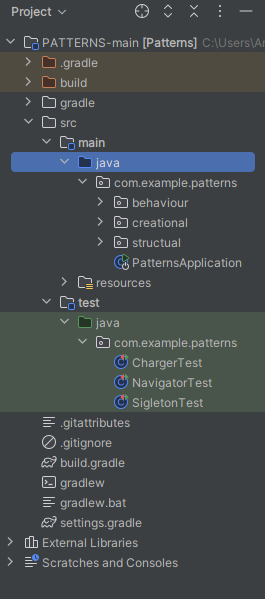

# $${\color{#ff0048}Integrate \space \color{#00f0ec}Patterns \space \color{Magenta}}$$

## Описание 
:rocket: **Использовали 3 вида паттернов и протестировали каждый из них**
 
:rocket: **Создающий = Singleton;**
 
:rocket: **Поведенческий = Strategy;**
 
:rocket: **Структурный = Adapter.**
## Использованные технологии
:white_check_mark:   JAVA
:white_check_mark:   Patterns
:white_check_mark:   Gradle
## Установка 
**Склонируйте репозиторий и запустите тесты в разделе Test через редактор кода (IntelliJ IDEA)**
 
:black_square_button: :black_square_button: :black_square_button:

